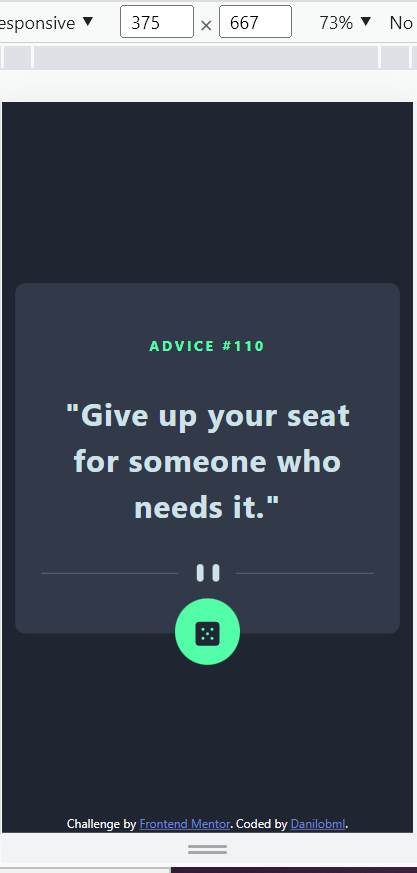
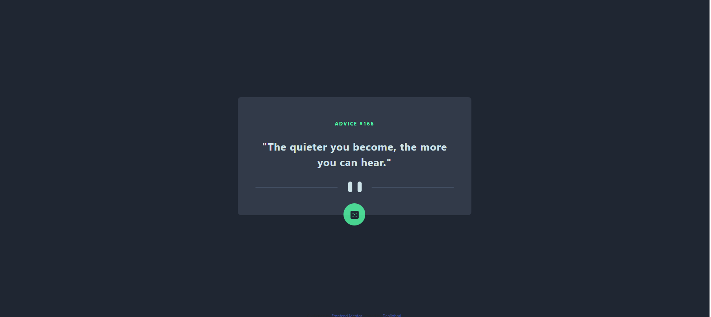
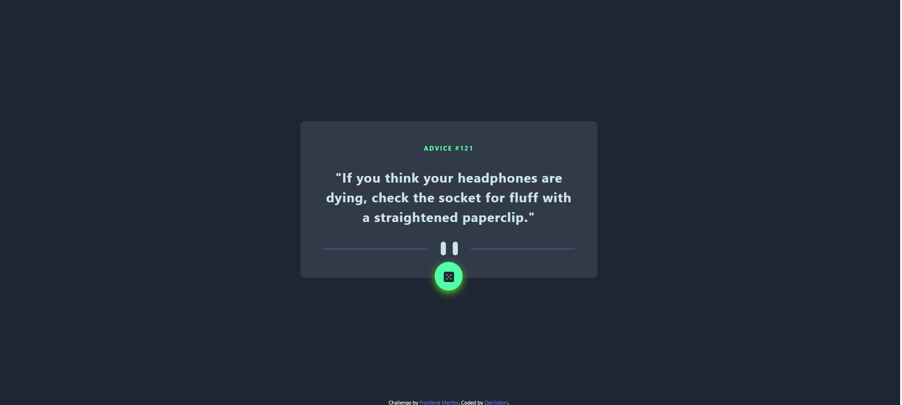

# Frontend Mentor - Advice generator app solution

This is a solution to the [Advice generator app challenge on Frontend Mentor](https://www.frontendmentor.io/challenges/advice-generator-app-QdUG-13db). Frontend Mentor challenges help you improve your coding skills by building realistic projects.

## Table of contents

- [Overview](#overview)
  - [The challenge](#the-challenge)
  - [Screenshot](#screenshot)
  - [Links](#links)
- [My process](#my-process)
  - [Built with](#built-with)
  - [What I learned](#what-i-learned)
  - [Continued development](#continued-development)
  - [Useful resources](#useful-resources)
- [Author](#author)
- [Acknowledgments](#acknowledgments)

**Note: Delete this note and update the table of contents based on what sections you keep.**

## Overview

I'd really appreciate any comments, tips and ways to improve! I'm still learning to use async await for the fetch. When I click repeatedly, it takes a time, sometimes even requiring two clicks to fetch again. How could I make it work better? I'd love to learn that.

### The challenge

Users should be able to:

- View the optimal layout for the app depending on their device's screen size
- See hover states for all interactive elements on the page
- Generate a new piece of advice by clicking the dice icon

### Screenshots

### Links

- Solution URL: (https://github.com/danilobml/fem-advice-generator)
- Live Site URL: (https://danilobml.github.io/fem-advice-generator/)

## My process

### Built with

- Semantic HTML5 markup
- CSS custom properties
- JavaScript
- Bootstrap 5 for responsiveness

### What I learned

I've learned to create a "glow effect" and practiced a bit the use of async await for the fecth.

### Continued development

I need to practice and understand better the async part.

### Useful resources

- [Superdevresources](https://superdevresources.com/css-button-glow-effect//) - Very heplful for the glow effect.
- [Stackoverflow](https://www.stackoverflow.com) - As always, helped me with a lot of things

## Author

- Website - [danilobml](https://github.com/danilobml)
- Frontend Mentor - [@danilobml](https://www.frontendmentor.io/profile/danilobml)

## Acknowledgments

As always, I'd like to think my teacher Ben at WBS Coding School.
